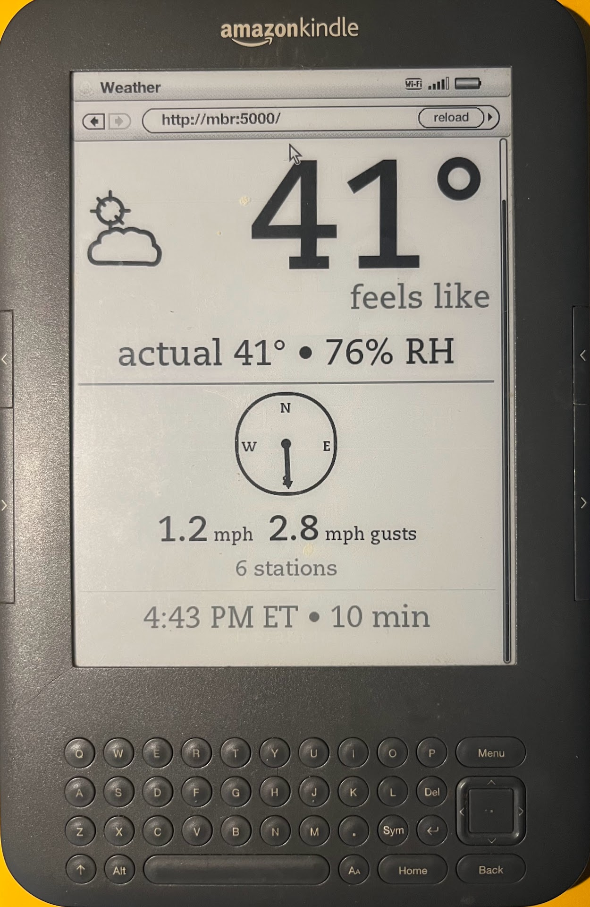
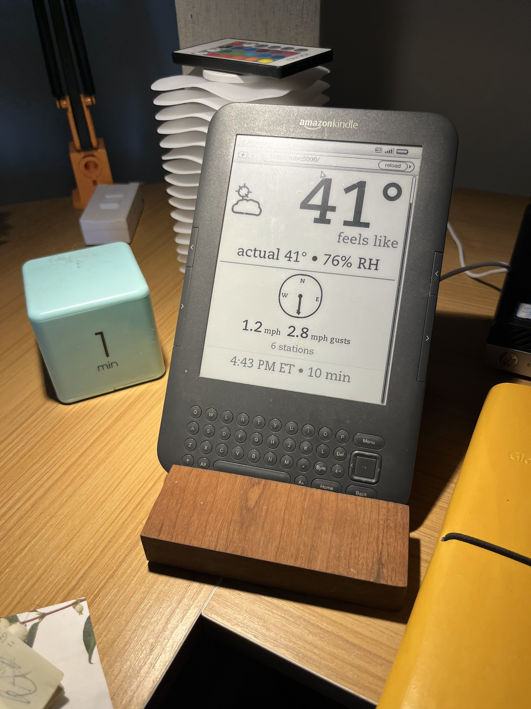

# hyperlocalWeather — in action

A 2010 Kindle Gen 3 (Kindle Keyboard) repurposed as a live hyperlocal weather display, powered by a Raspberry Pi running the hyperlocalWeather server.

---

## Screen close-up

The e-ink display showing a real reading:
- **Partly cloudy** condition icon (SVG, rendered natively by the Kindle browser)
- **41 °F** feels-like temperature as the centrepiece
- Actual 41 °F · 76 % RH below it
- **Wind compass** with needle pointing South — 1.2 mph avg, 2.8 mph gusts across 6 nearby stations
- Last updated **4:43 PM ET**, refreshing every **10 min**

The browser address bar shows `http://mbr:5000/` — the local hostname of the server on the home network.

---

## On the desk

The Kindle sits on a wooden desktop stand. The white stacked-disc enclosure visible in the background is the **PWS radiation shield** — the weather station whose readings are being displayed on screen. The device is kept plugged in to avoid battery drain from the always-on screen and active Wi-Fi.
